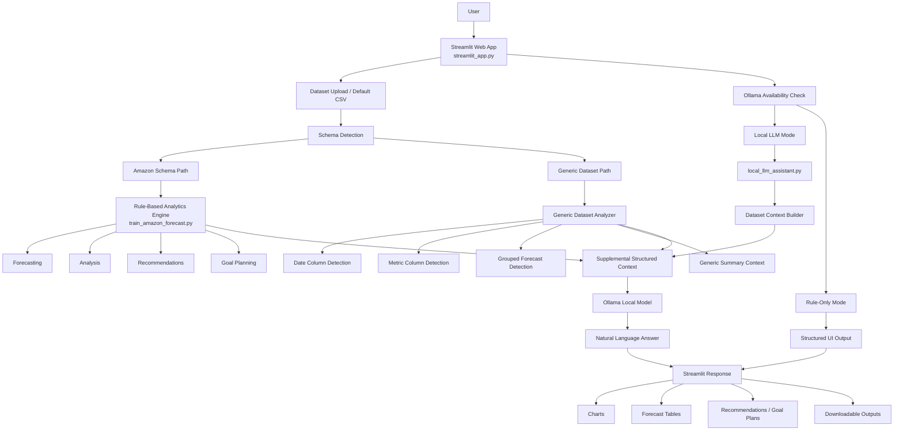

# Architecture Diagram

## Short Explanation

The application starts when the user interacts with the Streamlit app and either uploads a CSV file or uses the default dataset. The system then detects whether the uploaded file matches the Amazon schema or is a generic dataset.

If the dataset matches the Amazon schema, the rule-based analytics engine handles forecasting, analysis, recommendations, and goal planning. If the dataset is generic, the app performs generic column detection and builds a generalized data context.

When local LLM mode is enabled, the app checks Ollama availability and sends both dataset context and any structured results into the local model. The final answer is then shown in Streamlit together with charts, forecast tables, or recommendation outputs.
